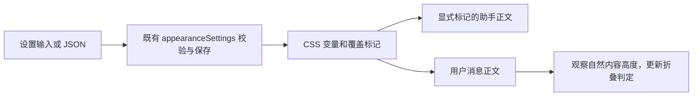

# 聊天正文独立排版

状态：已实现（规格由 Astra 编写，实现由后续 agent 完成）；单元与组件 E2E 通过，未在完整登录后工作区验收。基线：481acf0。范围为当前 ui 模块的已发送用户消息及助手正文；不修改编辑器输入、消息操作栏或时间标签。

## 配置与产品行为

扩展既有 `AppearanceSettings`，保持 `version: 1`，旧配置缺省新字段时外观不变：

| 字段             | 默认     | 范围与含义                                                    |
| ---------------- | -------- | ------------------------------------------------------------- |
| `chatFontFamily` | 空字符串 | 最长 160 字符的字体列表，校验与界面字体一致；空值继承界面字体 |
| `chatFontSize`   | `0`      | `0` 继承原字号；独立字号为 12–28 的整数 px                    |
| `chatLineHeight` | `0`      | `0` 继承原行距；独立行距为 100–240 的整数百分比               |

- 设置页显示独立排版区域，数值留空恢复继承。保存失败时保持旧值。
- JSON 合并、实时编辑、导出和重置涵盖上述字段；严格拒绝越界及错误类型，未写字段保持原值。
- 覆盖正文、段落、标题、列表、引用、表格文字、链接及用户消息；标题保留原来的 +4/+2/0px 层级，行内代码使用正文小 2px 的字号及已有等宽字体。
- 代码围栏和它的工具栏、表格操作按钮、消息操作栏、输入框、侧栏、终端、非聊天 Markdown 预览继续使用原设置。
- 公式仍使用 KaTeX 字体与独立公式设置；公式相对字号以正文为基准。
- 不修改根 font-size；默认配置不新增正文覆盖，恢复默认后移除投影属性。

## 状态与边界

唯一状态仍为 `ZCodeState.appearanceSettings`，沿用既有 setter、持久化与广播。三个 CSS 变量和对应的根属性只作为投影，不另建状态或回放逻辑。

助手通过 `MessageResponse.className` 显式接入，避免所有复用 Markdown 的面板都受到影响。用户消息的自然内容层独立于折叠按钮，观察自然内容高度，以保证字号变化后折叠状态不会过时。

本轮将聊天阅读内容纳入 DESIGN.md 的内容级字号例外；应用界面仍必须使用 `text-ui-*`。

## 验证

- 单元：旧配置默认值、数值边界、错误输入、导入合并与导出往返、DOM 投影与重置。
- 用实际 MessageResponse、ConversationUserInputBody 和 ConversationUserInputContent 构建测试场景，不能用外观相似的假段落代替。
- 浏览器检查：正文/标题/链接/表格/行内代码的计算样式；围栏代码、按钮和非聊天 Markdown 不变；折叠状态随着正文高度变化更新；刷新、浅深色、重置、窄屏。
- 记录覆盖矩阵及尚未验证的完整桌面业务场景，不把组件场景等同于全工作区验收。

## 实现记录

- 配置：`appearanceSettings.ts` 新增三个字段与 `CHAT_FONT_SIZE_RANGE`、`CHAT_LINE_HEIGHT_RANGE`；`0` 以外的值取整并限制范围，非有限数回退为继承。导入的有损归一化检查覆盖三个字段。
- 投影：`appearanceEnvironment.ts` 设置 `--appearance-chat-font`（用户字体后接 `var(--font-sans)`）、`--appearance-chat-size`（px）、`--appearance-chat-leading`（倍数），并在根元素设置对应 `data-appearance-chat-*` 属性；未设置时移除。
- 样式：`appearance.css` 在 `.appearance-chat-text` 作用域内重定义 `text-ui-*` 字号刻度，因此标题层级与行内代码（`text-ui-sm`）自动跟随；在代码块容器（`[data-language]`）、Mermaid、表格全屏与按钮内恢复全局刻度和界面字体。行距只作用于段落、列表、引用、标题、表格单元格和用户消息层，代码块容器继承助手正文根的原行距。
- 接入：`ConversationRowView` 的助手 `MessageResponse` 传入 `className="appearance-chat-text"`；`ConversationUserInputBody` 新增自然高度内层（`appearance-chat-text appearance-chat-plain`），`ResizeObserver` 改为观察该内层。
- 设置：新组件 `settings/ChatTypographySettings.tsx`，三个输入框失焦或回车提交，显示实际接受值；留空恢复继承。
- DESIGN.md：聊天阅读正文加入内容级字号例外，说明只在作用域内重定义刻度、不改 `--ui-font-size`。

## 覆盖矩阵

| 区域                                                     | 状态                                  |
| -------------------------------------------------------- | ------------------------------------- |
| 助手正文段落、标题、列表、引用、表格文字、链接、行内代码 | 组件 E2E 验证计算样式                 |
| 用户消息正文与折叠判定                                   | 组件 E2E 验证字号、行距与折叠按钮出现 |
| 代码块标题与正文、表格操作按钮、非聊天 Markdown          | 组件 E2E 验证不变                     |
| 分享只读页、工具调用内 Markdown、预览面板                | 未接入，保持原样式                    |
| 完整桌面工作区真实会话、流式输出中的正文                 | 未验证                                |
