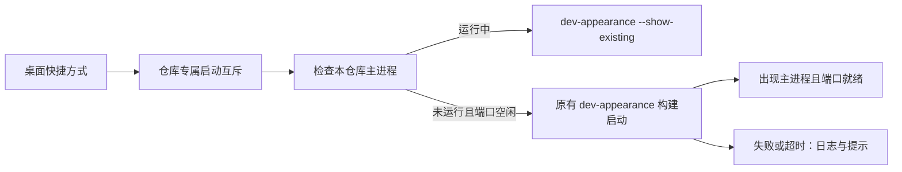

# Windows Preview 开发版桌面入口

目标：用户双击桌面快捷方式即可启动当前源码，不需要输入命令，也不需每次打包安装 exe。

- 入口名 `ZCode Preview 开发版`，指向源码仓库中的 PowerShell 启动器，使用仓库图标；不覆盖安装版快捷方式。
- 启动器优先使用相邻 `toolchains` 中符合 `mise.toml` 的 Node，检查 pnpm 和依赖已安装，不修改系统 Node 或执行策略。
- 实际环境及构建流程继续归 `scripts/dev-appearance.mjs` 所有；Windows 包装器不复制开发实例的数据目录环境变量。
- 有同一仓库的 Electron 主进程时，通过新 `--show-existing` 模式启动第二实例来唤回旧窗口，不重复构建。仅按本仓库 Electron 路径识别，不操作安装版。
- 冷启动走原有完整开发流程；使用进程间互斥锁阻止连续双击同时发起构建。若 5174 已被占用但找不到本仓库主进程，停止并提示，不清理或终止不明进程。
- 冷启动进程隐藏控制台，输出和错误写入 `.run-logs/appearance-launcher/`。启动等待最多 10 分钟；失败提示日志路径，超时仅终止本启动器启动的进程树。
- 快捷方式创建脚本可重复运行；遇到同名且不属于本项目的快捷方式时拒绝覆盖。
- 不复制源码为独立 exe，不改变源码热更新、不更改安装版数据、系统菜单或协议注册。

验证：PowerShell 语法解析、快捷方式目标/工作目录/图标检查、首次启动就绪日志、再次启动保持同一主进程、既有类型/lint/架构门禁。完整编译耗时和桌面数据仍由原有开发流程决定。
