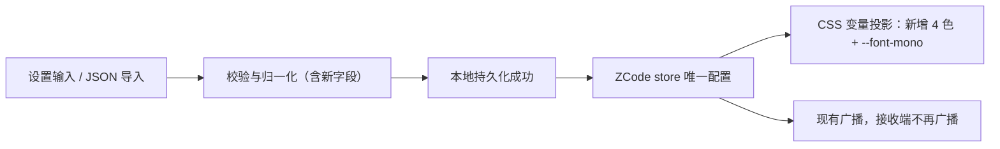

# 扩展配色与代码字体

状态：已实现，单元测试通过；未在完整登录后工作区做视觉验收。基线：872ad960de7ec172591f7e1952f7849229f94521 + 本 Fork 第一阶段改动。

## 背景

第一阶段的九项颜色只覆盖大面积背景、正文和边框。用户反馈导入预设后“感觉没改什么”：取色确认背景、卡片、输入框和字体都已生效，但对话中最显眼的链接、行内代码、主按钮和代码字体仍来自主题 CSS，无法通过自定义外观修改。

## 产品规则

在现有 `AppearanceSettings` 上新增以下可选项，仍使用 `version: 1`：

| 配置键                 | 投影的现有变量                 | 作用范围                                               |
| ---------------------- | ------------------------------ | ------------------------------------------------------ |
| `colors.*.link`        | `--color-icon-blue`            | 对话中的链接与文件链接（DESIGN.md 中该变量的链接角色） |
| `colors.*.inlineCode`  | `--color-markdown-inline-code` | 对话中行内代码底色；组件按 50% 透明度绘制              |
| `colors.*.primary`     | `--color-primary`              | 主按钮等主要操作的填充色                               |
| `colors.*.primaryText` | `--color-primary-foreground`   | 主要操作填充色上的文字与图标                           |
| `codeFontFamily`       | `--font-mono`                  | 代码块、行内代码、代码预览与 Diff 的等宽字体           |

- 颜色沿用六位十六进制校验，浅深色独立保存。初始化缺省值继承主题；当前 JSON 合并编辑中，空字符串清除覆盖，缺省键保持已有配置，具体以 `transfer.spec.md` 为准。
- `codeFontFamily` 沿用界面字体的字符集与 160 字符限制。投影时追加主题原有的等宽字体栈，保留中文回退；空字符串移除覆盖。
- 终端字体与终端配色仍由原终端设置管理，不受 `codeFontFamily` 或颜色覆盖影响。语法高亮配色不在本批范围。
- 不新增 CSS 变量，只覆盖已有语义变量，避免与上游主题产生第二套定义。
- 旧配置（无新字段）继续有效并得到相同外观；新导出的配置在旧版本中会因未知字段被拒绝，这是既有严格导入规则的预期结果。

## 状态所有者与顺序

不变。唯一状态仍为 ZCode store 的 `appearanceSettings`；新字段经 `normalizeAppearanceSettings` 校验，由 `setAppearanceSettings` 先持久化再接受，并通过 `applyAppearanceSettings` 投影、现有广播同步。

每次投影先移除全部受管变量（含 `--font-mono`），再读取主题原值，避免多次投影叠加字体栈。

## 验收场景

1. 旧配置仍可读取；当前合并导入中，`{"version":1}` 和缺省新字段不改动现有值，旧的整体替换语义已由 `transfer.spec.md` 更新。
2. 新颜色键与 `codeFontFamily` 可导入、导出往返；非法颜色、非法字体字符、未知颜色键被拒绝。
3. 设置新颜色后对应变量被覆盖；切换浅深色使用各自配置；恢复默认移除全部覆盖。
4. 设置代码字体后 `--font-mono` 以用户字体开头并保留原字体栈；清空后移除覆盖；重复投影不叠加。
5. 设置页出现四个新颜色项与“代码字体”输入，中英文文案齐全。

## 验证计划

- 单元：`packages/ui/test/appearanceSettings.test.ts`、`appearanceTransfer.test.ts` 补充上述场景。
- 执行 `pnpm typecheck`、`pnpm lint`、`pnpm fmt:check`、`pnpm architecture:check --changed`。
- 视觉：在开发实例导入更新后的预设，检查链接、行内代码、发送按钮与代码块字体。
