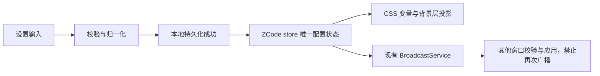

# 第一阶段：外观覆盖层

状态：本批基础功能已实现，单元与隔离组件 E2E 已通过；完整登录后工作区验收尚未完成。基线：872ad960de7ec172591f7e1952f7849229f94521。

## 行为与边界

在现有外观设置页增加自定义外观区域，支持本地背景图片、背景遮罩、模糊、填充方式、面板与侧栏背景不透明度、界面字体及核心语义颜色。保留现有主题、UI 字号、代码主题和终端字体入口。

第一批颜色覆盖包括应用背景、侧栏、面板、卡片、输入框、主色、正文、辅助文字和边框。空值表示继承原主题，浅深色分别保存覆盖，切换主题不丢失另一套配置。

默认值必须与当前外观一致。恢复默认只清除新增的外观配置，不改变现有主题选择、代码高亮或 UI 字号。

本文件记录基础阶段范围。后续已实现配置代码导入导出与合并编辑，见 [transfer.spec.md](transfer.spec.md)；扩展颜色与代码字体见 [extended-tokens.spec.md](extended-tokens.spec.md)，公式样式见 [math.spec.md](math.spec.md)。窗口透出桌面、任意 CSS、正文独立字号和方案库仍未实现。

## 唯一状态所有者与顺序

`packages/ui/src/store/index.ts` 中的现有 ZCode store 持有 `appearanceSettings`。纯配置模块负责结构和校验，浏览器适配模块负责读取、持久化和 DOM 投影。设置面板不另建已接受配置副本。

本地写入失败返回失败结果，界面显示可读错误，保留之前已接受状态。广播只接受完整的版本化配置；不支持的版本不覆盖本地状态。接收广播按已有 `applyingBroadcast` 机制防止回环。同一时刻多窗口编辑沿用现有消息到达顺序，最后接受的完整配置覆盖；不引入后台同步或服务端事实。

## 配置与资产

- 存储键 `zcode-appearance-v1`，配置有 `version: 1`。
- 图片仅允许 PNG、JPEG、WebP；读入前检查类型和体积，解码后确认是有效图片。第一版最多 2 MiB，保存为 data URL，因此不依赖原图片路径，也不发送外部图片请求。
- localStorage 配额不足必须提示，不得假装保存成功。失败导入不得丢失原图片。
- 数值必须有限并限制范围；字体名称有长度与字符限制；颜色仅接受六位十六进制值，DOM 赋值不拼接任意 CSS 文本。
- 背景使用独立、不可交互的装饰层，模糊和遮罩只影响图片；不对文字容器设置 opacity。
- 面板透明度只作用于结构背景变量，不全局降低按钮、弹窗或文字透明度。
- 浅深色切换及系统主题变化后重新应用当前模式的覆盖；重置移除全部覆盖变量，恢复主题继承。

## 模块与接口

所有实现归属现有 `ui` 模块，不引入跨包私有导入。新增纯配置、DOM/持久化适配及设置组件文件；在现有 store 和 `DesktopWindowFrame` 接入。通过现有服务上下文读取 store，不直接访问 Electron API。

现有 `text-ui-*` 字号规则保持不变。仅设置字体变量，不修改根 font-size。中英文文案同步提供。桌面与 Web 复用同一设置组件。

## 验收场景

1. 无配置或损坏配置启动时默认界面正常；未知版本安全回退。
2. 选择有效图片后背景显示，刷新后仍在；删除图片恢复默认。
3. 无效类型、损坏图片、超过限制和存储失败均有提示，旧配置保持。
4. 调整透明度、遮罩、模糊与填充即时生效，文字清晰且所有控件仍可点击。
5. 更换字体与颜色即时生效；浅深色独立；跟随系统变化和恢复默认正确。
6. 其他窗口收到设置后更新，不发生重复广播。
7. UI 在窄屏不横向溢出，中英文标签和键盘操作可用。
8. 代码主题与终端字体保持原有配置，不被新的字体输入误覆盖。

## 验证计划

- Node 单元测试：配置校验、异常存储、版本边界、模式覆盖、重置与消息处理。
- 浏览器交互场景：图片导入、控制调整、刷新持久化、浅深色切换、重置、窄屏。
- 执行 `pnpm typecheck`、`pnpm lint`、`pnpm architecture:check --changed`；记录基线失败与本次新增失败。
- 实际渲染检查完成前不宣称视觉验收通过。完整桌面启动如受已有运行资源阻塞，单独记录原因并验证可独立运行的界面部分。
