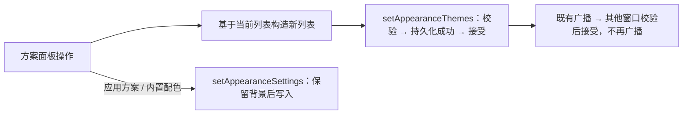

# 软件内主题方案

状态：已实现，单元与组件 E2E 通过；未在完整登录后工作区验收。

## 目标

用户可以在设置里保存、命名、切换、复制、覆盖和删除自己的外观方案，并一键套用内置配色，不必再手工粘贴 JSON。对应 GOALS.md“外观方案：内置默认方案、自定义方案、保存、切换”。

## 产品规则

### 内置配色

- 提供 7 套内置配色（与 `presets/` 中的示例同源：深海、暮夜、抹茶、暖砂、樱雾、石墨、霓虹），每套包含浅色与深色两组颜色。
- 套用内置配色**只替换 `colors`**（浅深色全部颜色键），字体、透明度、公式、聊天排版与背景图片保持不变。
- 内置配色只读，不可改名或删除；可以套用后再“保存为新方案”形成自己的副本。

### 我的方案

- 方案保存当前自定义外观的全部字段，**不含背景图片**；应用方案时替换除背景图片外的全部字段，当前背景保留。原因：每张背景最大 2 MiB，逐方案保存会很快耗尽 localStorage 配额；背景图片仍由背景设置与 JSON 导出管理。
- 操作：保存当前为新方案、应用、用当前外观覆盖、重命名、复制、删除（需再次点击确认）。
- 名称去除首尾空白，1–40 个字符；最多 30 个方案；达到上限时禁用新建与复制。
- 方案列表与当前外观相互独立：修改当前外观不会自动改动任何方案，需显式“覆盖”。

## 状态、持久化与同步

- 唯一所有者：ZCode store 新增 `appearanceThemes`，由 `store/appearanceState.ts` 的 `setAppearanceThemes` 写入；先持久化到 `zcode-appearance-themes-v1`（`{ version: 1, themes }`）成功再接受。
- 应用方案或内置配色只调用既有 `setAppearanceSettings`，不另建写入路径。
- 加载与接收广播时逐项校验：id 为 1–64 位字母数字/下划线/连字符，名称合规，`settings` 经 `normalizeAppearanceSettings` 且背景清空；重复 id 与超出上限的条目丢弃。损坏或未知版本回退为空列表。
- `appearanceThemes` 加入既有广播字段，接收端沿用 `applyingBroadcast` 防回环。

保存失败时显示错误，列表与当前外观保持原样。

## 验收

1. 套用内置配色只改变颜色；背景、字体、透明度不变。
2. 保存方案后修改外观，再应用方案可恢复（背景仍为当前背景）。
3. 重命名、复制、覆盖、删除（两次确认）行为正确；刷新后保持。
4. 另一窗口收到方案列表更新，且不再次广播。
5. 方案存储写入失败时提示错误，列表不变。
6. 名称校验、数量上限；中英文文案；窄屏无横向溢出。
