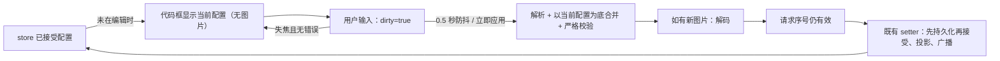

# 自定义外观配置代码：实时编辑与合并导入

状态：已实现并通过单元与交互验证（云端副本）；未在完整桌面工作区实测。新增行为归属既有 ui 模块。

## 变更原因

原版代码框初始为空，导入是“整体替换”：想改一项必须粘贴完整配置，漏写 `backgroundImage` 会清除已设置的背景图。用户要求代码框能直接改某一项、实时生效，且不影响已设置的背景。

## 产品规则

- 代码框始终显示当前已保存的自定义外观（格式化 JSON），**不含** `backgroundImage`：图片 data URL 可达数 MB，不适合手工编辑。
- 用户在代码框中编辑，停止输入约 0.5 秒后自动检查并应用；也可点击“立即应用”。检查失败只提示错误，不改变当前外观。
- 应用采用**合并**语义：
  - 写出的字段覆盖当前值，未写出的字段保持不变；`version` 可省略，写出时必须为 `1`。
  - `colors` 按浅深色、按颜色键逐项合并；某颜色值写 `""` 表示删除该覆盖、恢复继承主题。
  - 未写 `backgroundImage` 时保留当前背景；写 `""` 清除背景；写合法 data URL 设置新背景（先解码成功再应用）。
  - 因此可以只粘贴片段，如 `{"mathScale": 110}`。需要从零开始时先点“恢复自定义外观默认值”。
- 未知字段、类型错误、越界数值、非法颜色、非法字体字符、有损归一化仍严格拒绝，规则与原版一致。
- “导出并复制”复制包含背景图片的完整配置到剪贴板，用于分享或备份；代码框内容不变。剪贴板不可用时把完整配置放入代码框并提示手动复制。
- 代码框最大 3 MiB；背景沿用 2 MiB 约束。

## 状态与时序

唯一已接受状态仍为 ZCode store 的 `appearanceSettings`。代码框只持有草稿，并用 `dirty` 标记“用户正在编辑”。

- 编辑中（`dirty`）不以 store 的变化覆盖草稿，避免用户输入被打断；失焦且无错误时回到当前配置视图，其他控件或其他窗口的修改随之显示。
- 每次应用递增请求序号；新的输入、组件卸载或外部配置变化使旧请求失效，旧的图片解码结果不能覆盖较新的状态。
- 合并以**应用时刻**的已接受配置为底，而非开始编辑时的快照，避免覆盖期间由其他控件做出的修改。

## 验收

1. 打开设置即显示当前配置；修改某一数值或颜色后自动生效，其他字段与背景图不变。
2. 只粘贴片段可生效；`""` 删除颜色覆盖；`"backgroundImage": ""` 清除背景。
3. 错误 JSON、版本、未知字段、类型、边界、图片及存储失败均不改变当前配置，错误可见。
4. 编辑中拖动其他控件不覆盖草稿；失焦后代码框显示最新配置。
5. 导出复制含背景图的完整配置；剪贴板拒绝时可从代码框手动复制。
6. 刷新后保持应用结果；中英文文案齐全；窄屏可操作。

## 历史

- 初版（2026-09-22）：代码框初始为空，导入为整体替换。本版改为实时编辑与合并导入。
- 同轮启动恢复记录（安装版进程隐藏到托盘、经用户授权 UAC 重启）见 `CHANGELOG.md` 对应条目，未改动安装版二进制。
